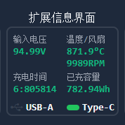
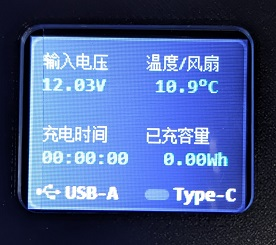

# CGUI / Chrome Generated UI 🚀
**A Chrome-driven ultra-lightweight UI engine | The "Hexo" of the Embedded World**

[中文介绍](README.cn.md)

`CGUI` is a ~~Blazing fast~~ *paradigm-shifting* embedded UI framework. It advocates for **"Sophistication at Design-time, Extreme Restraint at Run-time"**.

By utilizing Chrome to parse HTML/CSS layouts and rasterizing them during the build process, `CGUI` injects modern Web design capabilities into resource-constrained microcontrollers.


  
*(Note: Poor display quality in the photo is due to my low-end phone camera and cheap TN panel; the actual rendering is crisp.)*

> **Warning:** Currently in active development. API stability is not guaranteed. Please wait for $v1.0.0$.
> Translated via AI

---

## 💣 A Dimensional Strike

*   **Design as Code**: Stop fighting with heavy LVGL APIs or messy absolute positioning. Use the latest **Flexbox** layouts in HTML; let Chrome handle the rest.
*   **Web-Grade Quality**: Leverage Chrome’s font engine to generate bitmaps with **sub-pixel antialiasing**. Bring the elegance of *Google Fonts* to a cheap LCD.
*   **Zero Memory Overhead**: No complex component trees or context stacks at runtime. All UI states are compiled into a flat C structure. RAM usage depends solely on your business data.
*   **Peak Performance**: True fine-grained incremental updates. Based on character change detection, it only pushes modified pixels to the LCD (currently optimized for left-aligned or fixed-width layouts).
*   **Low-End Friendly**: Uses a modified **QOI format** for image compression. Flash footprint is only $10\% - 20\%$ of traditional bitmaps. Even an `STM32F103C8T6` can join the party.

---

## ⚙ Workflow

1.  **Design**: Author your UI using HTML/CSS. Mark dynamic data with `.cg-` classes and specify character sets via `cg-alphabet`.
2.  **Compile**: Run `npm run build`. The script launches a headless browser (Chrome/Firefox) to render the page, calculate coordinates, and extract bitmaps.
3.  **Reference**: The script generates `gui_XXX.h` and `gui_XXX.c`. This includes QOI-compressed background slices, font masks, and auto-generated incremental update logic: `CG_xxx_Update()`.
4.  **Deploy**: The HAL layer requires only `CG_HAL_setDrawWindow` and `CG_HAL_drawPixel`, with optional DMA support via `CG_HAL_fillArray`.

---

## 🌟 Features

*   **Font Engine**: Automatically extracts specific character sets. Supports proportional fonts and compressed bitmap masks.
*   **Image Compression**: Integrated QOI encoder significantly reduces Flash usage compared to raw RGB565.
*   **State Mapping**: Automatically 'toggles' CSS classes based on C variable values (e.g., `state == 0 ? .icon-off : .icon-on`).
*   **Background Recovery**: Intelligent "dirty rect" management. When values change, it restores the background before drawing new text, eliminating ghosting artifacts.

---

## 🚀 Quick Start

### 1. Write HTML
In your `index.html`:

```html
<div class="cg-screen" id="MainScreen">
    <div class="label">Voltage</div>
    <!-- Designed for MCUs without FPUs: Renders fixed-point decimals. -->
    <!-- If voltage=123, it displays "1.23V" -->
    <div class="value">
        <span class="cg-number"
              cg-bind="status.voltage"
              cg-dataType="int32_t"
              cg-alphabet="0123456789.-">0.00</span>
        <span class="cg-hide">V</span>
    </div>
</div>
```

#### 🧩 Core Directives

| Directive | Description | Example |
| :--- | :--- | :--- |
| `cg-bind` | **Binding**: Link to a C global variable or struct member. | `cg-bind="status.voltage"` |
| `cg-dataType` | **Data Type**: Specify C type for `Update` function arguments. | `cg-dataType="uint16_t"` |
| `cg-alphabet` | **Character Set**: Force font extraction for specific glyphs only. | `cg-alphabet="0123456789:."` |
| `cg-number` | **Numeric Render**: Optimized rendering with fixed-point mapping. | `class="cg-number"` |
| `cg-bar` | **Progress Bar**: Maps value to width/height automatically. | `class="cg-bar" cg-dir="right"` |
| `cg-renderer` | **Custom Renderer**: Bind C logic to format strings (e.g., Time). | `cg-renderer="#MyTimer"` |

### 2. Generate Code
*Requires Node.js 22+.*

```bash
npm run build [HTML file]
```
This compiles every `.cg-screen` with an `id` into `output/gui_<filename>.h` and `.c`.

### 3. C Integration
The interface is dead simple:

```c
#include "cgui.h"
#include "gui_PowerStation.h"

CG_MainScreen_State ui_state;

void main() {
    LCD_Init();
    CG_MainScreen_Init(&ui_state); // Render background & initial state

    while(1) {
        status.voltage = ADC_Get_Voltage();
        // Detects changes and performs local refresh
        CG_MainScreen_Update(&ui_state); 
    }
}
```

---

## 📊 Performance (Example 160x128 Screen)
*   **RAM**: ≈ 256 bytes (stack for decompression) + few dozen bytes for state tracking.
*   **Flash**: ≈ 4 KB for logic + assets (usually 10 - 50 KB per screen depending on graphics).

---

## ⛏ Tech Stack
*   **[GBK.JS](https://github.com/cnwhy/GBK.js)**: Binary search for optimized CJK performance.
*   **Modified QOI**: [Quite OK Image format](https://github.com/phoboslab/qoi) for bitmap compression.
*   **Selenium/Puppeteer**: Headless browser automation.

---

**CGUI - Rendering 2026 designs on 90s hardware (yes, I only have 64.0 KB ROM). This is what embedded development should look like.**